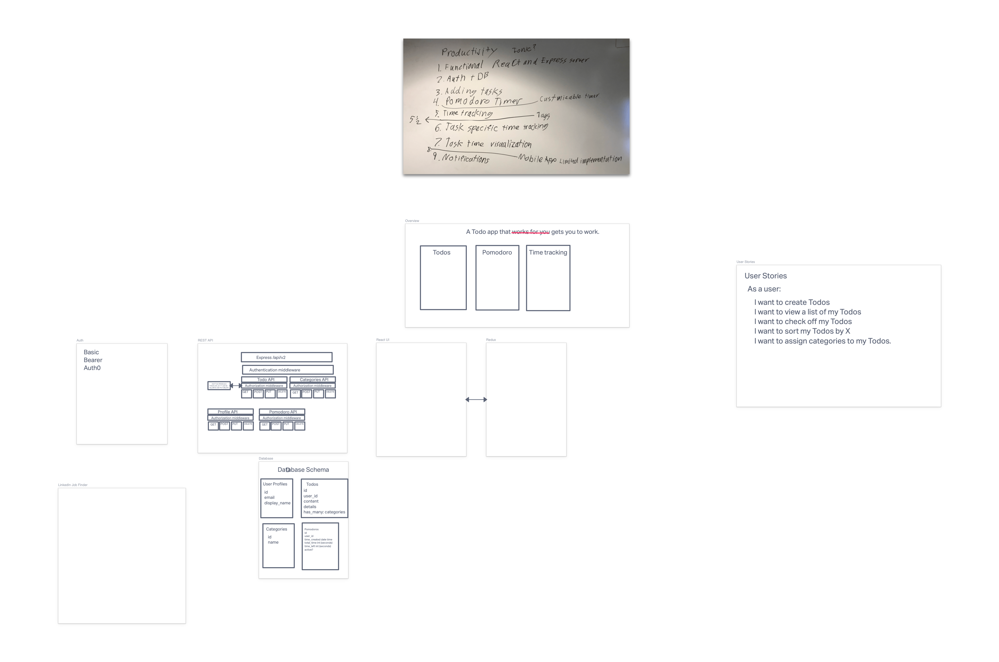

# RatRace Todos

A todo app that gets you to work!

## Overview

## Diagram

## Installation

Clone this repository.

    git clone https://github.com/Apple-Seed-Studios/ratrace.git

Download the dependencies.

    cd server; npm install; cd ..
    cd web-client; npm install; cd ..

Update your env variables in `server/env` and `web-client/env`

Start the server...

    cd server; npm run dev; cd ..

Start the client...

    cd web-client; npm start; cd ..
