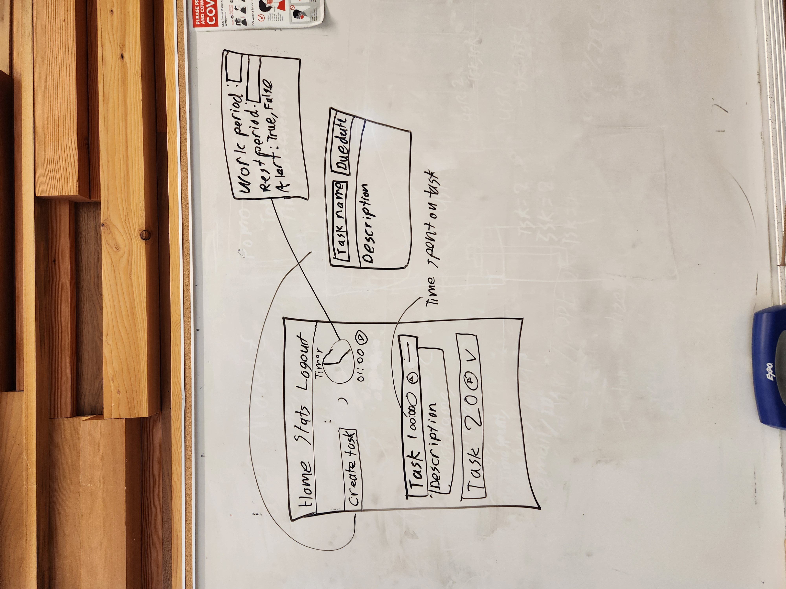

# RatRace Todos

A todo app that gets you to work!

## Overview

## Diagram

### UI Diagram

## Installation

Clone this repository.

    git clone https://github.com/Apple-Seed-Studios/ratrace.git

Download the dependencies.

    cd server; npm install; cd ..
    cd web-client; npm install; cd ..

Update your env variables in `server/.env` and `web-client/.env`

Add this to `server/.env`

    PORT=3001

Start the server...

    cd server; npm run dev; cd ..

Start the client...

    cd web-client; npm start; cd ..

## Contributions  

Sound Effect by <a href="https://pixabay.com/users/studioalivioglobal-28281460/?utm_source=link-attribution&amp;utm_medium=referral&amp;utm_campaign=music&amp;utm_content=123742">StudioAlivioGlobal</a> from <a href="https://pixabay.com//?utm_source=link-attribution&amp;utm_medium=referral&amp;utm_campaign=music&amp;utm_content=123742">Pixabay</a>
